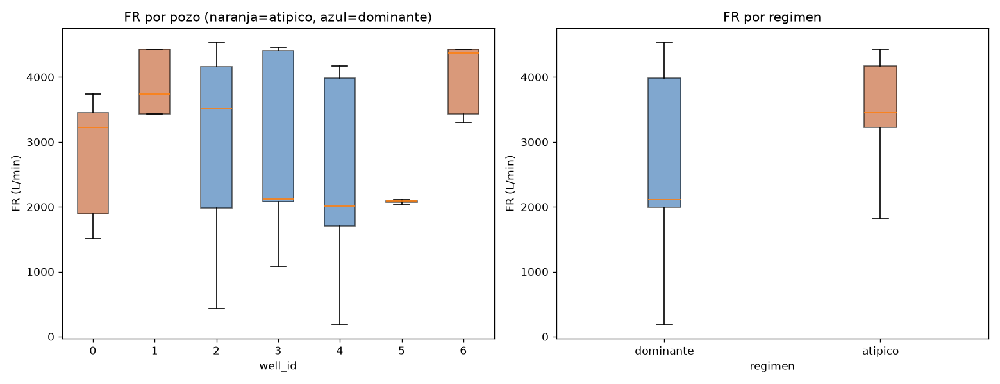

# M5 — Explicabilidad (SHAP) sobre el modelo candidato de M4

Generado por [`ml/explainability/shap_explain.py`](../ml/explainability/shap_explain.py)
(`python -m ml.explainability.shap_explain`), guardado en
[`docs/m5_shap_summary.json`](m5_shap_summary.json) y en PNG bajo
[`docs/shap/`](shap/). Modelo explicado: el candidato confirmado de M4 — LightGBM
tuneado original (`cbab6ab7...`, tag `m5_candidate=true` en MLflow), cargado desde
el artefacto ya logueado, no reentrenado. Explicado sobre las 198,928 filas de los
7 pozos (no solo CV-pool ni solo test), para poder comparar comportamiento entre
regímenes en el resto del documento.

`shap.TreeExplainer` (exacto para modelos de árboles, no aproximado). Chequeo de
aditividad (`suma(SHAP) + valor base == predicción del modelo`, sobre una muestra
de 500 filas): error máximo = 2.6e-13 — esencialmente cero, confirma que los
valores de SHAP calculados son correctos, no un artefacto numérico.

## Explicabilidad global

| Feature | mean(\|SHAP\|) |
|---|---|
| `FR` | **5.41** |
| `T` | 1.91 |
| `RPM_rolling_mean_10` | 1.82 |
| `VD` | 1.74 |
| `MD` | 1.67 |
| `SPP` | 1.26 |
| `DS` | 1.07 |
| `WOB` | 1.02 |
| `HL` | 0.80 |
| `RPM` | 0.42 |
| `GR` | 0.32 |
| `WOB_rolling_mean_10` | 0.29 |
| `HD` | 0.13 |
| `T_rolling_std_10` | 0.10 |
| `WOB_diff_1` | 0.01 |
| `gr_imputed` | ~0.00 |

Ver [`global_importance_bar.png`](shap/global_importance_bar.png) y
[`global_beeswarm.png`](shap/global_beeswarm.png).

**`FR` (caudal de lodo) domina por lejos** — 2.8x más importante que la segunda
variable (`T`). No es el resultado "de libro" que uno esperaría de un modelo de
ROP (WOB y RPM suelen ser los drivers primarios en la literatura, incluyendo el
propio Bourgoyne & Young). No se puede afirmar, solo con esto, si `FR` es una
señal físicamente real (limpieza del pozo, hidráulica) o si está actuando en
parte como proxy indirecto de identidad de pozo/tramo — no se investiga más a
fondo acá, queda anotado como pregunta abierta.

**Las 4 features de ventana de M3 no aportan parejo.** `RPM_rolling_mean_10` es
la 3ra más importante del modelo — señal real. Pero `WOB_rolling_mean_10` (0.29)
vale menos de un tercio que el `WOB` instantáneo (1.02), y `T_rolling_std_10`
(0.10) y sobre todo `WOB_diff_1` (0.01, prácticamente nula) aportan casi nada.
Esto es consistente con — y ahora tiene una explicación más concreta para — el
hallazgo de la ablation de M4 (sacar las 4 features de ventana mejoraba el test
2-5%): al menos 2 de las 4 (`WOB_diff_1`, `T_rolling_std_10`) parecen ser peso
muerto que el modelo apenas usa, más superficie para sobreajustar sin aportar
señal real a cambio.

`gr_imputed` (la columna de trazabilidad agregada en M2) tiene importancia
prácticamente nula — esperable, dado que afecta a 0.099% de las filas.

## Explicabilidad local

Waterfall plots para la primera fila de cada uno de los 3 pozos de test, en
[`shap/local/`](shap/local/): [`local_well_0.png`](shap/local/local_well_0.png),
[`local_well_3.png`](shap/local/local_well_3.png),
[`local_well_5.png`](shap/local/local_well_5.png).

Ejemplo (pozo 0, primera fila): predicción `f(x) = 18.14`, contra un valor base
`E[f(X)] = 24.69` (la media sobre las 198,928 filas). `FR` empuja la predicción
hacia abajo (-6.43, el mayor efecto individual en esta fila), parcialmente
compensado por `MD` (+3.62) y `VD` (+2.62). Consistente con el ranking global:
`FR` es el driver dominante también a nivel de una predicción individual, no
solo en promedio.

## Dependence plots de MD y HD — el resultado que se estaba buscando

Motivación: dado todo lo diagnosticado en M4 sobre el régimen geológico y el
fracaso del router basado en `MD`/`HD`, ¿el modelo mismo muestra algún quiebre de
comportamiento en estas variables consistente con la frontera de régimen? Se
reporta el resultado tal cual salió — podía no haber mostrado nada, no fue así.

### MD: sí hay un quiebre visible, y coincide con lo ya diagnosticado

El gráfico muestra dos formas completamente distintas, no una función continua
con ruido:

- **Régimen atípico (naranja, MD < ~700m):** el SHAP de `MD` sube fuerte desde
  ~0 hasta un pico de ~10-12.5 alrededor de MD≈400-500m, y después cae de nuevo
  hacia ~2-4 al acercarse a los 1000m.
- **Régimen dominante (azul, MD > ~1000m):** arranca en un rango similar
  (~0-3) pero con una tendencia decreciente sostenida a partir de ahí, llegando
  a valores negativos (-2 a -4) hacia los 4000m, con oscilaciones propias
  (picos/valles) que no continúan el patrón del régimen atípico.

La banda gris (634-988m) marca el gap sin cobertura en el CV-pool ya
identificado en el experimento de régimen de M4. A los dos lados de esa banda,
el comportamiento del modelo respecto a `MD` no solo tiene magnitudes distintas
— tiene **formas** cualitativamente distintas (subida-y-bajada en un régimen,
tendencia decreciente sostenida en el otro). Esto es consistente con la
explicación ya documentada en `docs/m4_results.md`: el modelo (no solo el
clasificador de régimen del experimento anterior) parece estar usando `MD`
parcialmente como proxy de a qué "cluster" de pozos pertenece la fila, no
únicamente como una medida física continua de profundidad. No es una prueba
formal de causalidad — es evidencia visual, consistente con el resto del
diagnóstico, no una confirmación estadística independiente.

### HD: no se ve el mismo quiebre

`HD` solo toma 3 valores discretos (215.9, 311.15, 444.5mm — diámetros de broca
estándar). Dentro de cada uno de los 3 valores, los puntos de ambos regímenes
**se mezclan** sin una separación clara — a diferencia de `MD`, acá no hay dos
formas distintas por régimen, hay una relación consistente entre diámetro y
SHAP (diámetros más grandes → SHAP más alto, físicamente razonable: hoyos más
grandes suelen ser tramos superficiales de formación más blanda y ROP más alta)
que se sostiene similar en ambos regímenes. **Resultado honesto: acá no se
encontró el mismo patrón** — el quiebre de régimen parece ser específico de
`MD`, no una propiedad general de "cualquier variable relacionada con geometría
del pozo".

## Conclusión de M5

La explicabilidad global no cambia la recomendación de M4 (no se decide una de
las 3 opciones acá tampoco), pero agrega una pieza de evidencia consistente: el
dependence plot de `MD` muestra el mismo patrón — el modelo se comporta de forma
cualitativamente distinta a cada lado de la frontera de régimen — que ya se
había visto en el fracaso del router de régimen. No es una casualidad aislada de
un experimento; aparece también en cómo el modelo final usa sus propias
features. `HD`, la otra variable candidata a explicar el régimen, no muestra el
mismo patrón — la frontera parece estar codificada específicamente en `MD`, no
en las variables de geometría de pozo en general.

Como hallazgo adicional, no buscado explícitamente pero relevante para
cualquier reporte final: `FR` (caudal), no `WOB` ni `RPM`, es la variable más
importante del modelo por un margen considerable — vale la pena marcarlo como
punto a discutir (¿señal real o proxy?) antes de presentar este modelo como
"aprendió física de perforación" sin matices. Se investiga a continuación.

## Chequeo de proxy: ¿`FR` es señal física o identidad de pozo disfrazada?

Motivado por ser la variable más importante del modelo (2.8x la segunda) sin ser
uno de los drivers "de libro" de ROP. Se midió cuánta de la varianza total de
`FR` se explica por el pozo y por el régimen, contra cuánta varía dentro de un
mismo pozo — la pregunta concreta es si SHAP podría estar usando `FR`
parcialmente para reconocer de qué pozo viene la fila, no (solo) la relación
física caudal→ROP.

| Pozo | FR media (L/min) | FR std |
|---|---|---|
| 0 | 2714 | 778 |
| 1 | 3915 | 477 |
| 2 | 3180 | 1038 |
| 3 | 2934 | 1090 |
| 4 | 2573 | 1038 |
| **5** | **2040** | **187** |
| 6 | 3993 | 469 |

ANOVA de `FR` por `well_id`: F=7158, p≈0. Por régimen: F=6784, p≈0 — con
~199,000 filas, casi cualquier diferencia da "significativa", así que el
p-valor no es lo informativo acá. Lo informativo es la proporción de varianza
explicada (η²):

- **η² por pozo = 0.178** — el 17.8% de la varianza total de `FR` se explica
  simplemente por saber en qué pozo está esa fila.
- **η² por régimen = 0.033** — solo 3.3% se explica por el régimen
  (dominante/atípico) en particular.

**Lectura honesta, sin forzar el resultado a un lado ni al otro:** el 82.2% de
la varianza de `FR` es *dentro* de cada pozo, no entre pozos — la mayoría de lo
que `FR` captura es variación real durante la perforación (probablemente
señal física genuina: caudal se ajusta activamente durante la operación), no
solo una etiqueta de identidad. Pero el 17.8% que sí varía sistemáticamente
por pozo **no es despreciable**, y el caso del pozo 5 es elocuente: su `FR` es
notablemente más bajo (media 2040) y con una dispersión extremadamente
angosta (std=187, contra 469-1090 en los demás pozos) — una firma casi tan
distintiva como un identificador de pozo directo. Con esta evidencia, **es una
limitación real de interpretabilidad, no una curiosidad sin resolver**: parte
de la importancia de `FR` en el modelo probablemente refleja identidad de pozo
filtrándose por una variable operacional, en la misma línea que ya se
documentó para `MD` — no se puede afirmar que el modelo "entendió la física
del caudal" sin esta salvedad. El régimen específicamente (dominante/atípico)
explica poco de esto (3.3%) — el efecto es más a nivel de pozo individual que
de régimen geológico.

## Latencia de SHAP para explicabilidad en tiempo real (input para M6)

Perfilado por `ml/explainability/shap_explain.py::profile_local_explanation_latency`
sobre 100 predicciones individuales simuladas (filas del test set, una por una,
como llegarían a un endpoint real), con `shap.TreeExplainer` ya inicializado
(warm-up previo, no se cuenta el costo de arranque). Números tomados de
[`docs/m5_shap_summary.json`](m5_shap_summary.json), no tipeados a mano:

| Métrica | Solo predicción (`model.predict`) | Explicación SHAP (`explainer(row)`) |
|---|---|---|
| p50 | 4.53 ms | **14.20 ms** |
| p95 | 5.80 ms | **21.02 ms** |
| p99 | — | 22.78 ms |
| media | 4.68 ms | 14.75 ms |

Calcular SHAP para una sola fila agrega **~9.7 ms** por encima de la predicción
sola (p50) — ambas siguen siendo rápidas en términos absolutos (p95 combinado
≈27 ms si se hacen las dos llamadas en secuencia), pero SHAP es **~3.1x más
lento** que predecir solo, y representaría **~76% del tiempo total** de una
respuesta que incluyera ambas cosas. No es un sistema de control en tiempo real
de milisegundos, así que en términos absolutos esto no es prohibitivo — pero la
sobrecarga relativa es real y vale la pena tenerla presente en la decisión de
M6.

**Input concreto para la decisión de arquitectura de M6:** con estos números,
no hay una razón de performance dura para separar `/predict` de `/explain` (~27
ms p95 combinado es perfectamente aceptable para un endpoint HTTP típico) —
pero si en M6 se anticipa alto volumen de requests donde la mayoría de los
consumidores no necesitan la explicación en cada llamada, servir SHAP bajo un
endpoint `/explain` separado y opcional evita pagar ese ~76% de overhead en el
camino caliente por defecto. No se decide acá cuál de las dos arquitecturas
usar — queda como insumo cuantificado para esa decisión en M6.

**Nota sobre el alcance de todo lo anterior en esta sección:** los plots y
números de explicabilidad global/local, los dependence plots de MD/HD, el
chequeo de proxy de `FR` y el perfil de latencia se calcularon sobre el
candidato de 16 features (`cbab6ab7...`). La sección siguiente simplifica el
pipeline y entrena un nuevo candidato — no se volvió a correr todo el análisis
de SHAP sobre ese modelo nuevo (quedaría por hacer si se necesita antes de un
reporte final; el chequeo de proxy de `FR` no depende del modelo y sigue
siendo válido tal cual, ya que es una propiedad de los datos, no de las
predicciones).

## Simplificación del pipeline de M3 (post-SHAP)

Evidencia acumulada de que `WOB_diff_1` (mean\|SHAP\|=0.01) y `T_rolling_std_10`
(0.10) no aportan señal real: la ablation de M4 ya había mostrado que sacar
las 4 features de ventana mejoraba el test, y SHAP ahora muestra *cuáles* de
esas 4 son las culpables — `RPM_rolling_mean_10` (1.82) y `WOB_rolling_mean_10`
(0.29) sí tienen peso real, `WOB_diff_1` y `T_rolling_std_10` son casi
inertes. Se sacaron esas dos de `ml/features/pipeline.py` (14 features en vez
de 16), se mantuvo `RPM_rolling_mean_10` y `WOB_rolling_mean_10`, y se
reentrenó con el mismo protocolo (Optuna, 15 trials, LOWO-CV de 4 folds sobre
el CV-pool, mismo test).

| Métrica | Candidato original (16 features) | Candidato simplificado (14 features) | Diferencia |
|---|---|---|---|
| CV MAE (LOWO) | 7.79 | 8.37 | +7.5% peor en CV |
| Test pooled | 11.59 | **10.89** | **+6.1% mejor** |
| Test dominante | 10.59 | **9.62** | **+9.1% mejor** (empata casi con el dummy, 9.64) |
| Test atípico (pozo 0) | **16.83** | 17.47 | -3.8% peor |
| Test pozo 3 | 9.29 | **8.17** | +12.0% mejor (empata con el dummy, 8.18) |
| Test pozo 5 | 14.31 | **13.77** | +3.8% mejor |

**No empeoró — mejoró, con una salvedad.** El pedido era avisar si el
resultado empeoraba de forma relevante antes de promover; ocurrió lo
contrario en el agregado (pooled +6.1%, dominante +9.1%, prácticamente
empatando al dummy en dos de los tres pozos de test). La única regresión es
el pozo atípico (-3.8%), que ya era el punto más débil del candidato original
y sigue siéndolo — consistente con todo lo diagnosticado en M4: el problema
de fondo (escasez de pozos atípicos) no lo resuelve simplificar features,
pero tampoco lo empeora de forma que amerite frenar la promoción. Se
promueve el candidato simplificado.

Nuevo candidato: run `7a98edb39bf84f4e99f00937eccd12c8` en MLflow, tag
`m5_candidate=true` (movido desde `cbab6ab7...`, que queda tageado
`superseded_by` apuntando al nuevo). Detalle completo en
[`docs/m5_simplified_candidate.json`](m5_simplified_candidate.json).
