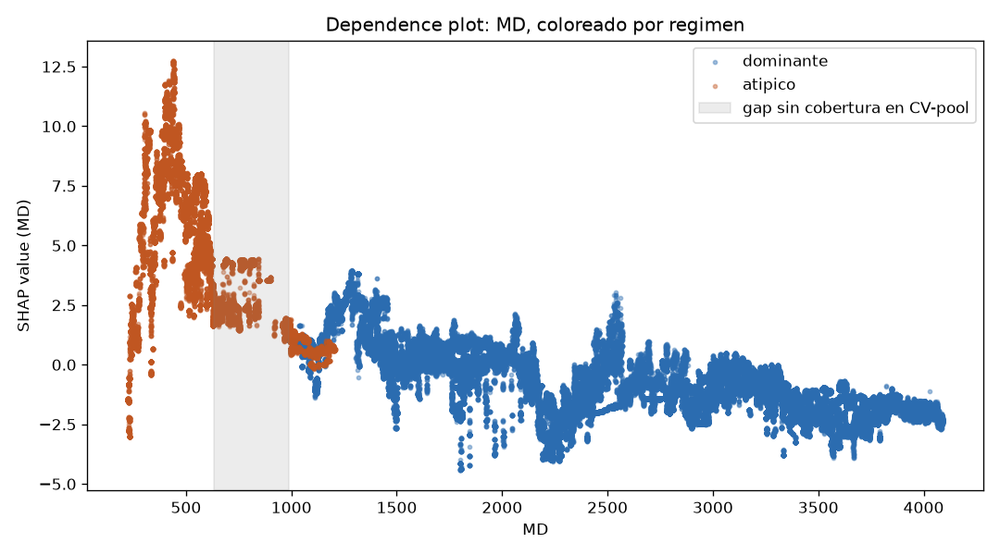
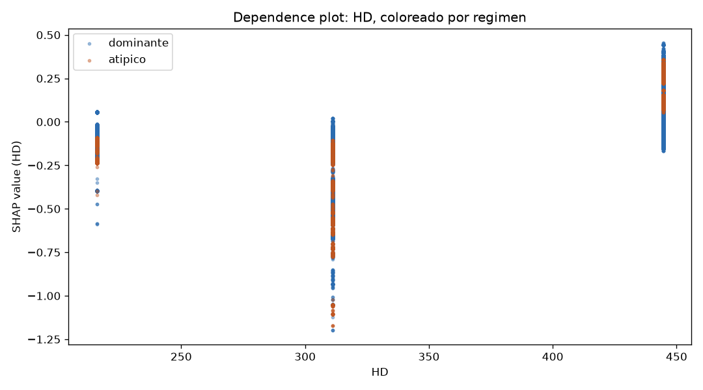

# M5 — Explicabilidad (SHAP) sobre el modelo candidato de M4

Generado por [`ml/explainability/shap_explain.py`](../ml/explainability/shap_explain.py)
(`python -m ml.explainability.shap_explain`), guardado en
[`docs/m5_shap_summary.json`](m5_shap_summary.json) y en PNG bajo
[`docs/shap/`](shap/). Modelo explicado: el candidato confirmado de M4 — LightGBM
tuneado original (`cbab6ab7...`, tag `m5_candidate=true` en MLflow), cargado desde
el artefacto ya logueado, no reentrenado. Explicado sobre las 198,928 filas de los
7 pozos (no solo CV-pool ni solo test), para poder comparar comportamiento entre
regímenes en el resto del documento.

`shap.TreeExplainer` (exacto para modelos de árboles, no aproximado). Chequeo de
aditividad (`suma(SHAP) + valor base == predicción del modelo`, sobre una muestra
de 500 filas): error máximo = 2.6e-13 — esencialmente cero, confirma que los
valores de SHAP calculados son correctos, no un artefacto numérico.

## Explicabilidad global

| Feature | mean(\|SHAP\|) |
|---|---|
| `FR` | **5.41** |
| `T` | 1.91 |
| `RPM_rolling_mean_10` | 1.82 |
| `VD` | 1.74 |
| `MD` | 1.67 |
| `SPP` | 1.26 |
| `DS` | 1.07 |
| `WOB` | 1.02 |
| `HL` | 0.80 |
| `RPM` | 0.42 |
| `GR` | 0.32 |
| `WOB_rolling_mean_10` | 0.29 |
| `HD` | 0.13 |
| `T_rolling_std_10` | 0.10 |
| `WOB_diff_1` | 0.01 |
| `gr_imputed` | ~0.00 |

Ver [`global_importance_bar.png`](shap/global_importance_bar.png) y
[`global_beeswarm.png`](shap/global_beeswarm.png).

**`FR` (caudal de lodo) domina por lejos** — 2.8x más importante que la segunda
variable (`T`). No es el resultado "de libro" que uno esperaría de un modelo de
ROP (WOB y RPM suelen ser los drivers primarios en la literatura, incluyendo el
propio Bourgoyne & Young). No se puede afirmar, solo con esto, si `FR` es una
señal físicamente real (limpieza del pozo, hidráulica) o si está actuando en
parte como proxy indirecto de identidad de pozo/tramo — no se investiga más a
fondo acá, queda anotado como pregunta abierta.

**Las 4 features de ventana de M3 no aportan parejo.** `RPM_rolling_mean_10` es
la 3ra más importante del modelo — señal real. Pero `WOB_rolling_mean_10` (0.29)
vale menos de un tercio que el `WOB` instantáneo (1.02), y `T_rolling_std_10`
(0.10) y sobre todo `WOB_diff_1` (0.01, prácticamente nula) aportan casi nada.
Esto es consistente con — y ahora tiene una explicación más concreta para — el
hallazgo de la ablation de M4 (sacar las 4 features de ventana mejoraba el test
2-5%): al menos 2 de las 4 (`WOB_diff_1`, `T_rolling_std_10`) parecen ser peso
muerto que el modelo apenas usa, más superficie para sobreajustar sin aportar
señal real a cambio.

`gr_imputed` (la columna de trazabilidad agregada en M2) tiene importancia
prácticamente nula — esperable, dado que afecta a 0.099% de las filas.

## Explicabilidad local

Waterfall plots para la primera fila de cada uno de los 3 pozos de test, en
[`shap/local/`](shap/local/): [`local_well_0.png`](shap/local/local_well_0.png),
[`local_well_3.png`](shap/local/local_well_3.png),
[`local_well_5.png`](shap/local/local_well_5.png).

Ejemplo (pozo 0, primera fila): predicción `f(x) = 18.14`, contra un valor base
`E[f(X)] = 24.69` (la media sobre las 198,928 filas). `FR` empuja la predicción
hacia abajo (-6.43, el mayor efecto individual en esta fila), parcialmente
compensado por `MD` (+3.62) y `VD` (+2.62). Consistente con el ranking global:
`FR` es el driver dominante también a nivel de una predicción individual, no
solo en promedio.

## Dependence plots de MD y HD — el resultado que se estaba buscando

Motivación: dado todo lo diagnosticado en M4 sobre el régimen geológico y el
fracaso del router basado en `MD`/`HD`, ¿el modelo mismo muestra algún quiebre de
comportamiento en estas variables consistente con la frontera de régimen? Se
reporta el resultado tal cual salió — podía no haber mostrado nada, no fue así.

### MD: sí hay un quiebre visible, y coincide con lo ya diagnosticado

El gráfico muestra dos formas completamente distintas, no una función continua
con ruido:

- **Régimen atípico (naranja, MD < ~700m):** el SHAP de `MD` sube fuerte desde
  ~0 hasta un pico de ~10-12.5 alrededor de MD≈400-500m, y después cae de nuevo
  hacia ~2-4 al acercarse a los 1000m.
- **Régimen dominante (azul, MD > ~1000m):** arranca en un rango similar
  (~0-3) pero con una tendencia decreciente sostenida a partir de ahí, llegando
  a valores negativos (-2 a -4) hacia los 4000m, con oscilaciones propias
  (picos/valles) que no continúan el patrón del régimen atípico.

La banda gris (634-988m) marca el gap sin cobertura en el CV-pool ya
identificado en el experimento de régimen de M4. A los dos lados de esa banda,
el comportamiento del modelo respecto a `MD` no solo tiene magnitudes distintas
— tiene **formas** cualitativamente distintas (subida-y-bajada en un régimen,
tendencia decreciente sostenida en el otro). Esto es consistente con la
explicación ya documentada en `docs/m4_results.md`: el modelo (no solo el
clasificador de régimen del experimento anterior) parece estar usando `MD`
parcialmente como proxy de a qué "cluster" de pozos pertenece la fila, no
únicamente como una medida física continua de profundidad. No es una prueba
formal de causalidad — es evidencia visual, consistente con el resto del
diagnóstico, no una confirmación estadística independiente.

### HD: no se ve el mismo quiebre

`HD` solo toma 3 valores discretos (215.9, 311.15, 444.5mm — diámetros de broca
estándar). Dentro de cada uno de los 3 valores, los puntos de ambos regímenes
**se mezclan** sin una separación clara — a diferencia de `MD`, acá no hay dos
formas distintas por régimen, hay una relación consistente entre diámetro y
SHAP (diámetros más grandes → SHAP más alto, físicamente razonable: hoyos más
grandes suelen ser tramos superficiales de formación más blanda y ROP más alta)
que se sostiene similar en ambos regímenes. **Resultado honesto: acá no se
encontró el mismo patrón** — el quiebre de régimen parece ser específico de
`MD`, no una propiedad general de "cualquier variable relacionada con geometría
del pozo".

## Conclusión de M5

La explicabilidad global no cambia la recomendación de M4 (no se decide una de
las 3 opciones acá tampoco), pero agrega una pieza de evidencia consistente: el
dependence plot de `MD` muestra el mismo patrón — el modelo se comporta de forma
cualitativamente distinta a cada lado de la frontera de régimen — que ya se
había visto en el fracaso del router de régimen. No es una casualidad aislada de
un experimento; aparece también en cómo el modelo final usa sus propias
features. `HD`, la otra variable candidata a explicar el régimen, no muestra el
mismo patrón — la frontera parece estar codificada específicamente en `MD`, no
en las variables de geometría de pozo en general.

Como hallazgo adicional, no buscado explícitamente pero relevante para
cualquier reporte final: `FR` (caudal), no `WOB` ni `RPM`, es la variable más
importante del modelo por un margen considerable — vale la pena marcarlo como
punto a discutir (¿señal real o proxy?) antes de presentar este modelo como
"aprendió física de perforación" sin matices.
